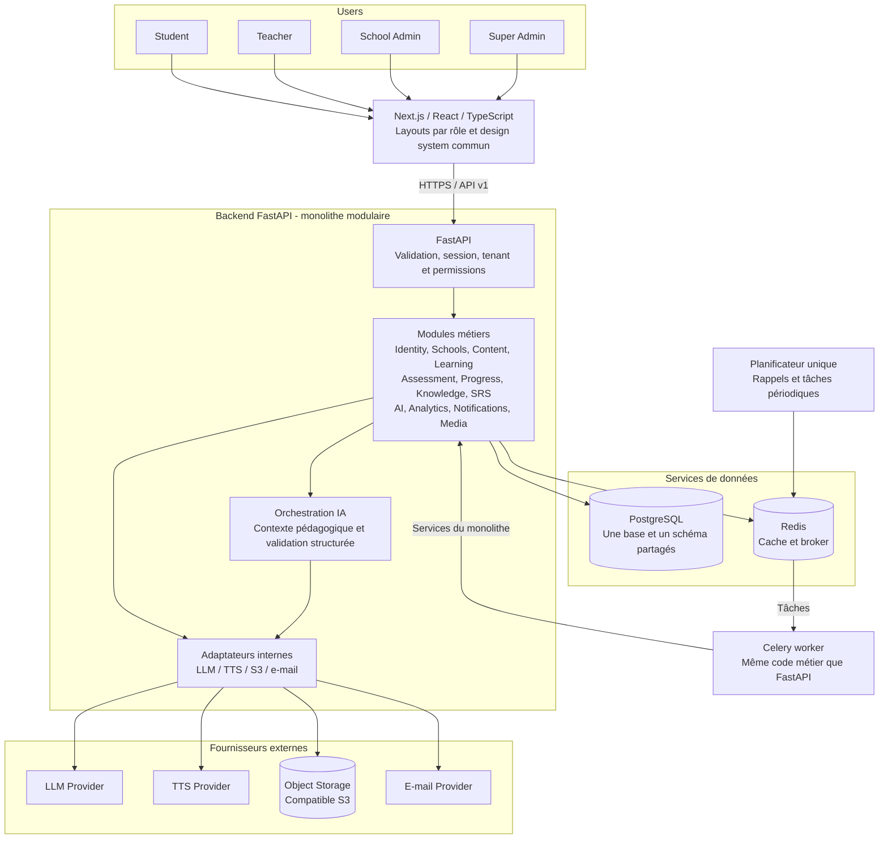
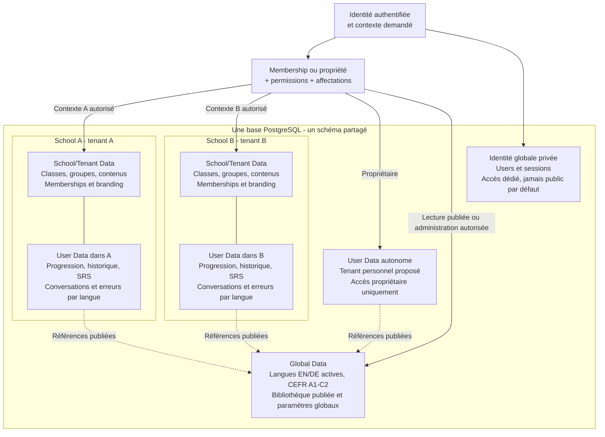
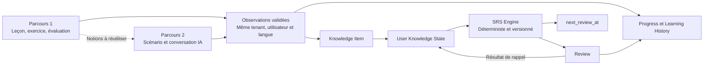

# Diagrammes de l’architecture Lingua AI

Conception du 30 septembre 2026. Les blocs décrivent la cible ; seul le socle Next.js, FastAPI, PostgreSQL et Redis est préparé à l’étape Docker. Voir [l’architecture](architecture.md) pour les responsabilités, le scope et les arbitrages.

## Composants et flux techniques

PostgreSQL et Redis ne servent pas de relais réseau vers les fournisseurs : les adaptateurs du backend les appellent. Les médias privés peuvent ensuite être lus par le navigateur avec une URL signée autorisée. Les clés fournisseur restent côté serveur. Le worker est un processus du même produit, pas un microservice autonome. Le reverse proxy et la CI/CD sont des choix de déploiement ultérieurs, absents de l’architecture active actuelle.

## Séparation logique des données

Ces blocs ne représentent pas des bases séparées. User Data désigne des données personnelles à l’intérieur d’un contexte, pas une quatrième base. Les conversations et résultats de A ne deviennent pas visibles à B parce que l’utilisateur possède deux memberships. L’accès autonome et la fusion éventuelle des progressions sont explicités dans l’arbitrage A03. Les noms d’école et les claims du navigateur n’accordent aucun accès par eux-mêmes.

## Boucle pédagogique et indépendance du SRS

Le LLM propose des observations ; les services métier valident leur effet. Le SRS fonctionne sans appel LLM pour calculer les échéances. Aucun composant offline, stockage navigateur persistant ou synchronisation n’est prévu. Les notifications restent dans le périmètre fonctionnel, avec un canal à arbitrer séparément.
